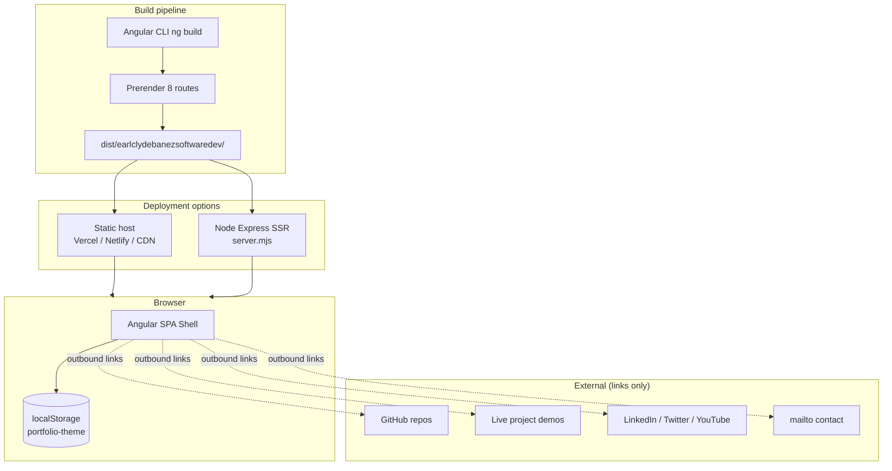
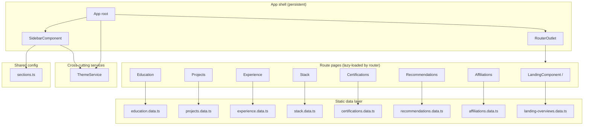
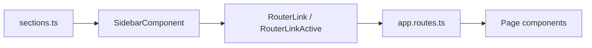
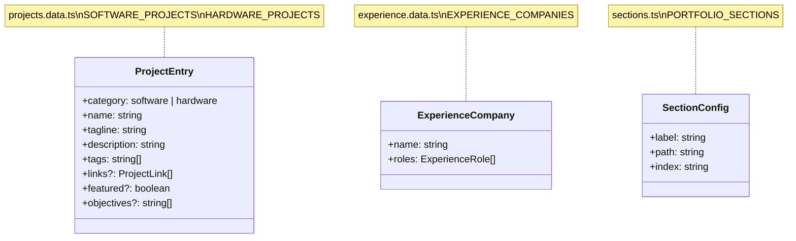
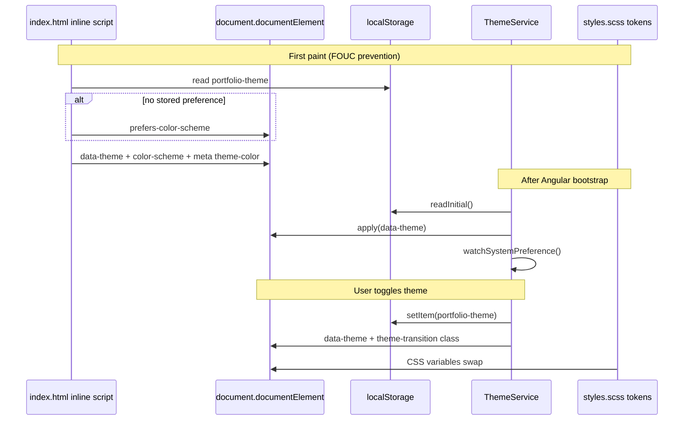
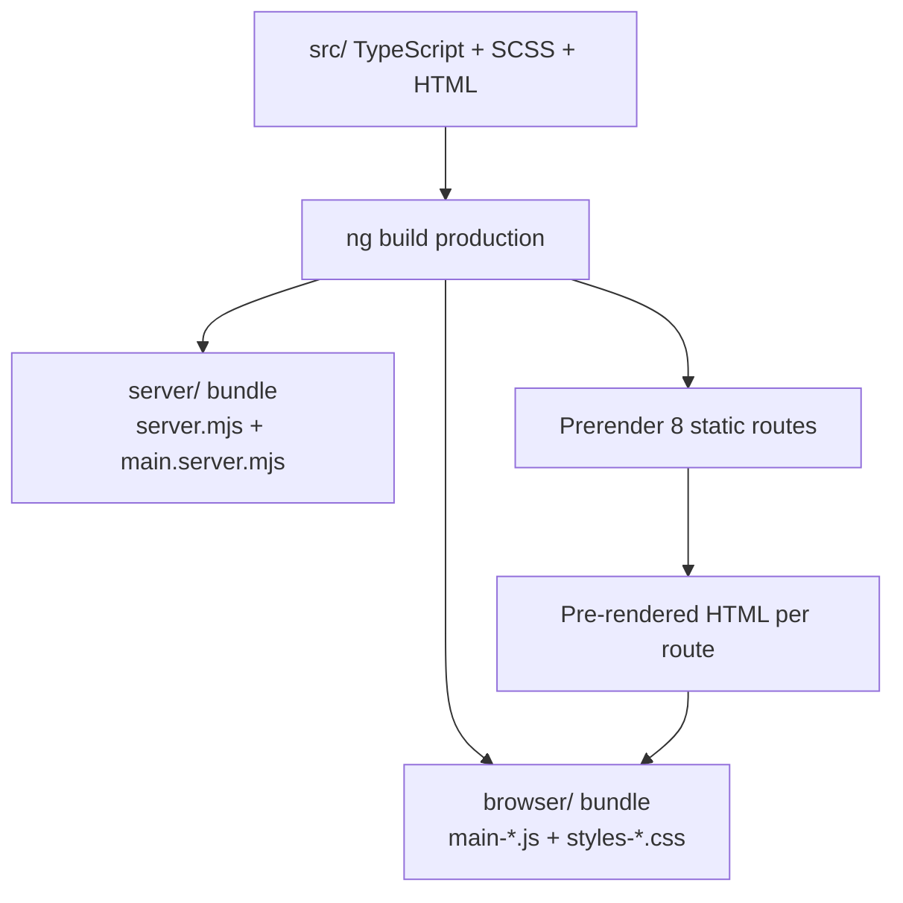
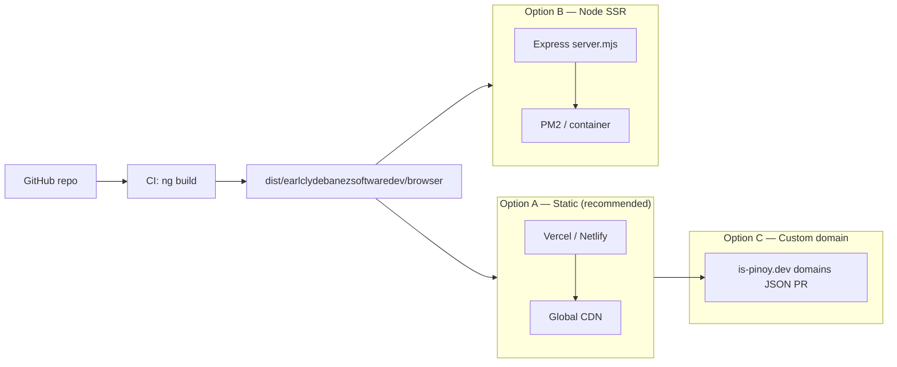

# System Architecture — Earl Clyde Banez Portfolio

**Product:** Static-first personal portfolio (Obsidian Atelier / Parchment Atelier)  
**Stack:** Angular 21 · SSR + prerender · SCSS design tokens · Vitest  
**Author:** Earl Clyde Banez  
**Last updated:** July 2026

---

## 1. Executive summary

This application is a **content-driven, static-first portfolio website**. There is no backend API, database, or authentication. All résumé content lives in typed TypeScript data modules; the Angular app renders that content into themed page components. Production builds **prerender all routes** to static HTML, which can be served from any static host (Vercel, Netlify, CDN) or via the bundled Express SSR server.

| Property | Value |
|----------|-------|
| Architecture style | Static site + optional SSR shell |
| State | Client-only (`ThemeService` + `localStorage`) |
| Data source | In-repo `*.data.ts` modules |
| Rendering | Prerender (build time) + client hydration |
| Theming | CSS custom properties via `[data-theme]` |

---

## 2. System context



The portfolio **does not call external APIs at runtime**. GitHub, Vercel demos, and social links are standard anchor tags opened in new tabs.

---

## 3. High-level application architecture



### Layer responsibilities

| Layer | Responsibility |
|-------|----------------|
| **Shell** | Fixed sidebar navigation, theme toggle, `<router-outlet>` for page content |
| **Pages** | One standalone component per portfolio section; owns layout + section-specific UI |
| **Data** | Typed arrays/interfaces; single source of truth for copy, links, and metadata |
| **Services** | `ThemeService` — theme signal, DOM application, persistence, system preference sync |
| **Config** | `sections.ts` — nav metadata shared between sidebar and landing overviews |
| **Styles** | Global tokens in `styles.scss`; page SCSS co-located with components |

---

## 4. Directory structure

```
earlclydebanezsoftwaredev/
├── angular.json                 # Build, SSR, prerender, budgets
├── package.json                 # Angular 21, Express 5, Vitest
├── docs/
│   └── ARCHITECTURE.md          # This document
├── public/                      # Static assets (favicon, etc.)
└── src/
    ├── index.html               # Inline theme bootstrap (FOUC prevention)
    ├── main.ts                  # Browser bootstrap
    ├── main.server.ts           # Server bootstrap
    ├── server.ts                # Express static + SSR fallback
    ├── styles.scss              # Design tokens (dark/light), global imports
    └── app/
        ├── app.ts               # Root shell component
        ├── app.html             # Sidebar + router-outlet layout
        ├── app.scss             # Shell grid (sidebar + main)
        ├── app.config.ts        # Router, hydration, ThemeService init
        ├── app.config.server.ts # Server rendering providers
        ├── app.routes.ts        # Client routes (8 paths)
        ├── app.routes.server.ts # Prerender config (all routes)
        ├── config/
        │   └── sections.ts      # PORTFOLIO_SECTIONS nav config
        ├── services/
        │   └── theme.service.ts # Theme state + localStorage
        ├── components/
        │   └── sidebar/         # Navigation, theme switch, connect links
        └── pages/
            ├── landing/         # Hero + section overview previews
            ├── education/
            ├── projects/        # Software / hardware catalog + filter
            ├── experience/      # Company-grouped timeline
            ├── stack/
            ├── certifications/
            ├── recommendations/
            ├── affiliations/
            └── shared/
                └── page.scss    # Shared page typography utilities
```

Each page folder follows the pattern:

```
pages/<section>/
├── <section>.ts          # Standalone @Component
├── <section>.html
├── <section>.scss
├── <section>.data.ts     # Content (where applicable)
└── <section>.spec.ts     # Vitest unit tests
```

---

## 5. Routing & navigation

### Route map

| Path | Component | Content source |
|------|-----------|----------------|
| `/` | `LandingComponent` | `landing-overviews.data.ts` + inline hero |
| `/education` | `Education` | `education.data.ts` |
| `/projects` | `Projects` | `projects.data.ts` (software + hardware) |
| `/experience` | `Experience` | `experience.data.ts` |
| `/stack` | `Stack` | `stack.data.ts` |
| `/certifications` | `Certifications` | `certifications.data.ts` |
| `/recommendations` | `Recommendations` | `recommendations.data.ts` |
| `/affiliations` | `Affiliations` | `affiliations.data.ts` |

### Navigation model



- **Portfolio sections (01–07):** driven by `PORTFOLIO_SECTIONS` in `config/sections.ts`.
- **Feed:** `/` with `routeExact: true` so only the landing route is active.
- **Thoughts:** disabled placeholder (no route).
- **Connect:** external `href` links (mailto, social).

Keyboard shortcuts (`1`–`7`, `8` for Feed) are defined in sidebar config but rendered as labels; full keyboard routing can be added later.

---

## 6. Data architecture

All content is **compile-time static**. No HTTP client, no NgRx, no environment-based CMS.



### Projects data model (extended)

Projects are split into two exported arrays:

- `SOFTWARE_PROJECTS` — 15 web/ML/full-stack entries
- `HARDWARE_PROJECTS` — 2 embedded/IoT entries (Helmivo, Smart Entry Gate)

The `Projects` component exposes a client-side filter (`all | software | hardware`) via Angular `signal()`. Filtering is pure in-memory — no URL query params yet.

Smart Entry Gate carries optional academic fields (`objectives`, `scope`, `limitations`, `significance`) rendered in a `<details>` accordion.

---

## 7. Theming system

Dual theme: **Obsidian Atelier** (dark) and **Parchment Atelier** (light).



| Concern | Implementation |
|---------|----------------|
| Token storage | CSS custom properties on `:root` / `[data-theme='dark'|'light']` |
| Persistence key | `localStorage['portfolio-theme']` |
| SSR safety | `isPlatformBrowser` guards in `ThemeService` |
| FOUC prevention | Inline `<script>` in `index.html` before stylesheet load |
| Init hook | `APP_INITIALIZER` injects `ThemeService` at bootstrap |
| UI control | Sidebar footer theme switch (moon / pill / sun) |

Fonts (Google Fonts): **Syne** (display), **Libre Franklin** (body), **Libre Baskerville** (serif quotes), **JetBrains Mono** (labels/code).

---

## 8. Rendering & build pipeline



### Render modes

| Mode | When | Config |
|------|------|--------|
| **Prerender** | `ng build` (production) | `app.routes.server.ts` → `RenderMode.Prerender` for `**` |
| **SSR (Express)** | `node dist/.../server/server.mjs` | `server.ts` → `AngularNodeAppEngine` |
| **Client hydration** | Browser after HTML load | `provideClientHydration(withEventReplay())` |
| **Dev** | `ng serve` | HMR, no prerender |

### Express server (`src/server.ts`)

1. Serves hashed assets from `browser/` with 1-year cache.
2. Falls through to Angular SSR engine for unmatched routes.
3. Listens on `PORT` (default `4000`).

For **static-only deployment**, serve the `browser/` folder; prerendered HTML is already embedded at build time.

---

## 9. UI composition patterns

### App shell layout

```
┌─────────────────────────────────────────────────────┐
│ app-shell (CSS grid)                                │
│ ┌──────────┬──────────────────────────────────────┐ │
│ │ Sidebar  │ main-content                           │ │
│ │ 252px    │   ┌────────────────────────────────┐   │ │
│ │ fixed    │   │ router-outlet → active page    │   │ │
│ │ nav      │   └────────────────────────────────┘   │ │
│ │ theme    │                                          │ │
│ │ search   │                                          │ │
│ └──────────┴──────────────────────────────────────┘ │
└─────────────────────────────────────────────────────┘
```

Below `768px` the sidebar is hidden; mobile nav can be extended later.

### Page design patterns

| Page | UI pattern |
|------|------------|
| Landing | Hero manifesto + linked section previews (no card wrappers) |
| Projects | Filter pills + 2-col catalog grid + indexed cards |
| Experience | Company-grouped vertical timeline |
| Certifications | 2-col white “credential card” grid |
| Recommendations | Masonry-style quote cards |
| Education | Typographic date column + degree block |
| Stack | Grouped pill tags by category |
| Affiliations | Org badge rows |

Shared typography utilities live in `pages/shared/page.scss`, imported globally from `styles.scss`.

---

## 10. Cross-cutting concerns

### Performance

- Prerendered HTML → fast first contentful paint
- No runtime API waterfall
- Component-scoped SCSS with production budgets (`anyComponentStyle` 8 kB warning)
- Google Fonts preconnect in `index.html`

### Accessibility

- Semantic landmarks (`<main>`, `<nav>`, `<section>`, `aria-labelledby`)
- Focus-visible styles on filter buttons and links
- `prefers-reduced-motion` disables card entrance animations
- `color-scheme` meta + CSS for native form controls

### Testing

- **Vitest** via `@angular/build:unit-test` (component specs per page)
- `ThemeService` has dedicated unit tests with platform mocking

### Security

- No user input forms (no XSS surface from submissions)
- External links use `rel="noopener noreferrer"`
- No secrets in repo; static content only

---

## 11. Deployment topology



**Recommended:** Deploy `dist/earlclydebanezsoftwaredev/browser` as a static site. Prerendering already produces HTML for all 8 routes.

---

## 12. Extension points

| Future feature | Suggested approach |
|----------------|-------------------|
| Thoughts / blog | New route + markdown loader or headless CMS |
| CMS-driven content | Replace `*.data.ts` with build-time fetch or SSR API |
| URL-based project filter | `?category=software` via `ActivatedRoute` query params |
| Mobile sidebar | Drawer component + hamburger in shell |
| Analytics | Inject script in `index.html` or Angular `APP_INITIALIZER` |
| i18n | `@angular/localize` + duplicate or extract data modules |
| Search | Client-side fuse.js over flattened data exports |

---

## 13. Technology inventory

| Category | Technology | Version |
|----------|------------|---------|
| Framework | Angular (standalone components) | 21.2 |
| Language | TypeScript | 5.9 |
| Styling | SCSS + CSS variables | — |
| Routing | `@angular/router` | 21.2 |
| SSR | `@angular/ssr` + Express | 21.2 / 5.1 |
| Reactivity | Angular signals (`ThemeService`, project filter) | — |
| Testing | Vitest + jsdom | 4.0 |
| Package manager | npm | 11.18 |

---

## 14. Related documents

| Document | Location |
|----------|----------|
| Design system master | `design-system/earl-clyde-banez-portfolio/MASTER.md` |
| Landing page overrides | `design-system/earl-clyde-banez-portfolio/pages/landing.md` |
| Angular CLI defaults | `README.md` |

---

*This architecture reflects the codebase as of July 2026. Update this document when adding backend services, CMS integration, or new route groups.*
